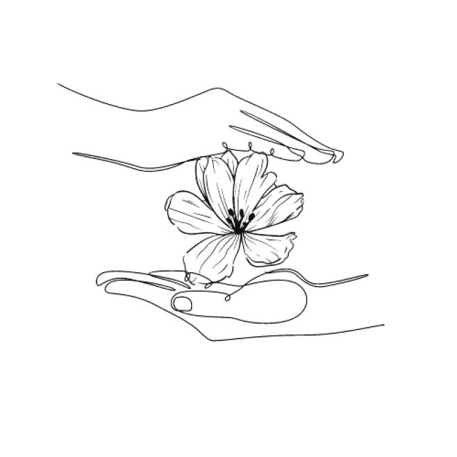

# Todo App Flores del Tambo

Full Stack Application made with React, Node.js, Express and MongoDB.

This To do App allows users to add, edit and delete tasks as well as see the whole list.

Users can also view the tasks they have completed and those they have deleted in a pop-up window.

## To do list

[Live Demo](https://mern-flores-tambo.herokuapp.com/)

## Installation

1. `cd client`
2. `npm install`
3. `npm start`

## Team

- Marcela Beltrán
- Juan Casas
- Angie Ladino
- Mateo Patarroyo
- Valeria Ziegler
